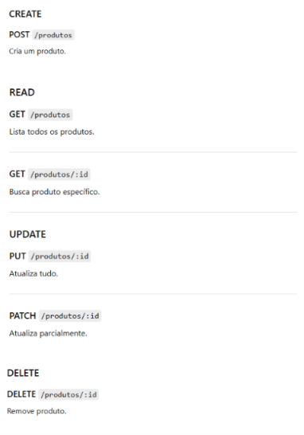

# Estoque_Comercio

## Clonar o repositorio
1. Na sua maquina abra o git bash e escreva ```git clone LINK DO REPOSITORIO```
2. Verifique se está na branch certa através de ```git branch -a``` (vai aparecer ```*main```)
3. Faça ```git pull origin main``` no terminal do projeto para baixar tudo que foi commitado
   * Vai aparecer a mensagem abaixo quando não tiver modificações e as modificações quando houver
``` 
    * branch   main  -> FETCH_HEAD     Already up to date
```

## Dependencias do BackEnd
* PS: Rodar na sua maquina apenas as dependencias necessárias. O VsCode avisa qual está faltando 
````
• npm init -y (Inicializar projeto) (Não precisa rodar novamente)
• npm install express cors sequelize sqlite3 dotenv (Dependências principais) ( todas devem rodar ao clonar o repositorio)
• npm install --save-dev sequelize-cli (Dependências de desenvolvimento)
• npm install --save-dev nodemon (reinicia o servidor automaticamente)
````

## Criação de arquivos BackEnd
1. Cria a pasta src
2. Dentro da src roda ```npx sequelize-cli init``` gerando a estrutura de desenvolvimento

## Dependencias do FrontEnd
* PS: Rodar na sua maquina apenas as dependencias necessárias. O VsCode avisa qual está faltando  
````
• npx create-vite@latest frontend (Criar projeto React) (Não precisa rodar novamente)

- Dentro da pasta vite-project
• npm install (Instalar dependências )
• npm install axios (Instalar Axios )
````

## Subir para o repositorio
1. Faça ```git pull origin main``` para ter certaza que não está com conflito de informações
* Vai aparecer a mensagem abaixo quando não tiver modificações e as modificações quando houver (Depois disso segue próximos passos) 
``` 
    * branch   main  -> FETCH_HEAD     Already up to date
```

2. Faça ```git add .```
3. Faça ```git commit -m "TITULO DO COMMIT"```
4. Faça ```git push origin main``` para subir as novas informações

## Abrir o banco de dados
```npx sequelize-cli db:migrate```

## Rodar a aplicação
1. Abra o terminal e entre na pasta FronEnd através de ```cd FrontEnd```
2. Rode no terminal ```npm run dev```
3. Abra um novo teminal (não feche o que está com o front aberto) e entre na pasta BackEnd através de ```cd BackEnd```
4. Rode no novo terminal ```node src/server.js```

## Rotas utilizadas

