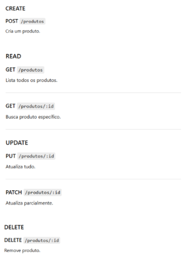

# Estoque_Comercio

## Cria uma nova branch
1. Acesse branches
2. New branch
3. Defini um nome para a branch e salva

## Clonar o repositorio
1.Copie o link do repositorio
 * PS: O link do repositório está em ```<>code```. É o ```HTTPS```
2. Na sua maquina abra o git bash em arquivos e escreva ```git clone LINK DO REPOSITORIO```

## Dependencias do BackEnd
* PS: Rodar cada dependencia dentro da pasta especifica. Nesse caso, a ```BackEnd```
* PS: Rodar na sua maquina apenas a dependencia necessária, ou seja, ```npm install```. Caso seja necessário rodar outra dependencia o projeto não vai iniciar e o VsCode vai avisar que está faltando 
````
• npm init -y (Inicializar projeto) 
• npm install express cors sequelize sqlite3 dotenv (Dependências principais) 
• npm install --save-dev sequelize-cli (Dependências de desenvolvimento) 
• npm install --save-dev nodemon (reinicia o servidor automaticamente)

- Rodar ao clonar
• npm install (todas devem rodar ao clonar o repositorio pois vai permitir os testes)
````

## Criação de arquivos BackEnd (Não precisa rodar ao clonar)
1. Cria a pasta src
2. Dentro da src roda ```npx sequelize-cli init``` gerando a estrutura de desenvolvimento

<!-- ## Dependencias do FrontEnd
* PS: Rodar cada dependencia dentro da pasta especifica. Nesse caso, a ```FrontEnd```
* PS: Rodar na sua maquina apenas as dependencias necessárias, ou seja, ```npm install```. Caso seja necessário rodar outra dependencia o projeto não vai iniciar e o  VsCode vai avisar que está faltando 
````
• npx create-vite@latest frontend (Criar projeto React) (Não precisa rodar novamente)

- Dentro da pasta vite-project
• npm install (Instalar dependências ) 
• npm install axios (Instalar Axios )

- Rodar ao clonar
• npm install (Instalar dependências ) (todas devem rodar ao clonar o repositorio pois vai permitir os testes)
```` -->

## Arquivos Front-End
1. Está dividido em HTML, CSS e JavaScript
   
## Subir alterações para o repositório
1. Verifique em qual branch você está:
```git branch -a```

2. Acesse a branch principal:
```git checkout develop```

3. Atualize sua branch local com a versão mais recente da `develop`:
```git pull origin develop```

* Se estiver tudo atualizado, aparecerá algo parecido com:
```bash
* branch            main       -> FETCH_HEAD
Already up to date.
```

4. Acesse a branch que você criou:
* Primeira vez:

```git checkout -b NOME_DA_BRANCH origin/NOME_DA_BRANCH```

* Próximas vezes:
```git checkout NOME_DA_BRANCH```

5. Adicione os arquivos modificados:
```git add .```

6. Faça o commit das alterações:
```git commit -m "TÍTULO DO COMMIT"```

* PS: O título do commit deve representar claramente o que foi alterado para manter o histórico organizado e compreensível.

7. Envie as alterações para o repositório remoto:
```git push origin NOME_DA_BRANCH```

## Abrir o banco de dados (Não rodar ao clonar o repositorio)
```npx sequelize-cli db:migrate```

## Rodar a aplicação 
**FRONTEND**
<!-- 1. Abra o terminal e entre na pasta FronEnd através de ```cd FrontEnd```
2. Acesse a pasta vite-project através de ````cd vite-project````
3. Rode no terminal do FrontEnd ```npm run dev```
4. Coloque o link que aparecer no seu navegador para ver as telas -->
1. Clique em live server na pasta do HTML para mostrar a tela

**BACKEND**
<!-- 1. Abra um novo teminal (não feche o que está com o front aberto) e entre na pasta BackEnd através de ```cd BackEnd``` -->
1. Acesse a pasta ````BackEnd```` através de ````cd BackEnd````
2. Rode no terminal BackEnd ```node src/app.js```

## Rotas utilizadas

